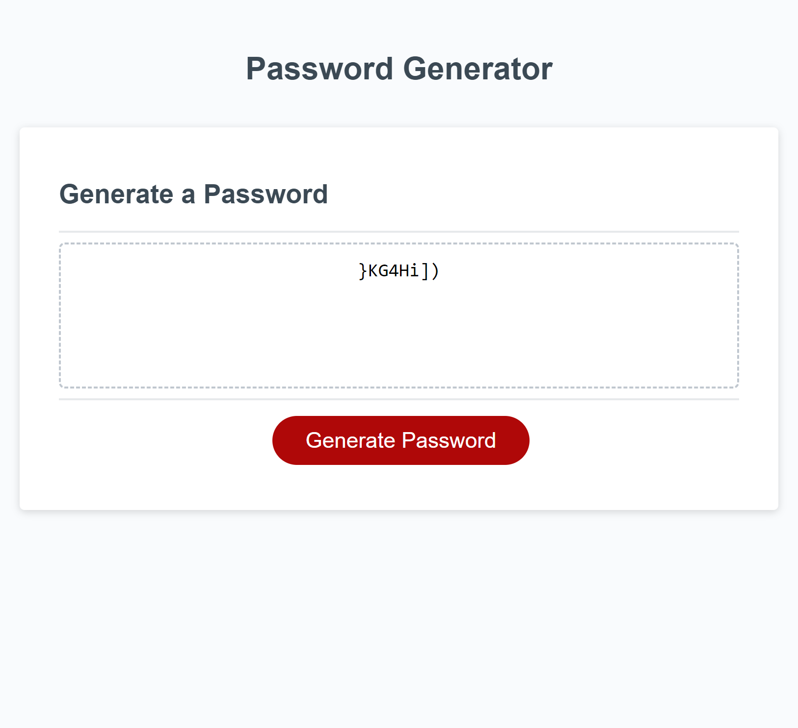

# Password Generator

## Table of contents

- [Overview](#overview)
  - [The challenge](#the-challenge)
  - [Mock-up](#mock-up)
  - [Website](#website)
- [My process](#my-process)
  - [Built with](#built-with)
  - [What I learnt](#what-i-learnt)

## Overview

### The challenge
This proejct is to create an application that generates a random password based on the given conditions. It includes special characters, uppercase and lowercase, and numeric characters. It also has a condition for it to be 8 to 128 characters using JavaScript. The prompt for the user to enter the password length is answered before generating and displaying a random password.

### Mock-up

The following image shows the web application's appearance and functionality:

### Website
Deployed application: https://yvonne0711.github.io/password-generator/ 

## My process

### Built with
- HTML
- CSS
- JavaScript

### What I learnt
- Functions throughoug the whole file
- Prompting the user for password length but didn't manage to figure out how to give more options incorporated into the rest of the code
- Used the property `Math.floor` and `Math.random`
- Merged the characters together using the method [`.concat`](https://developer.mozilla.org/en-US/docs/Web/JavaScript/Reference/Global_Objects/Array/concat)
- Used a [`for` loop](https://www.w3schools.com/js/js_loop_for.asp) to iterate through each password character
- Given code for functionality of generating a password on-click of a button
- A difficult challenge using JavaScript with many functions needed
